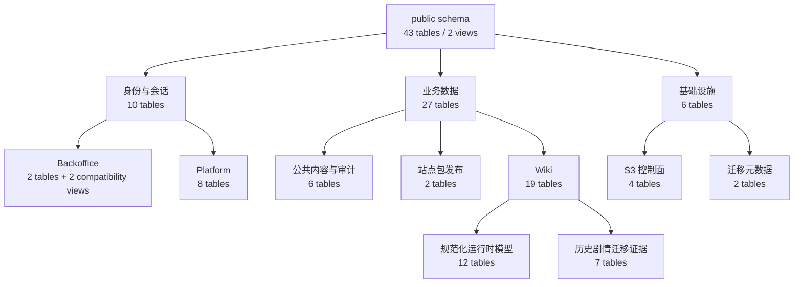
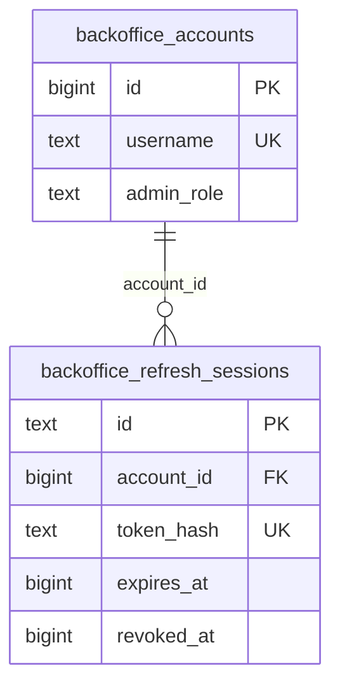
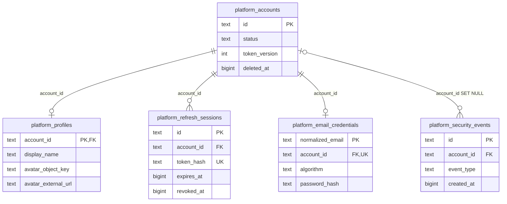
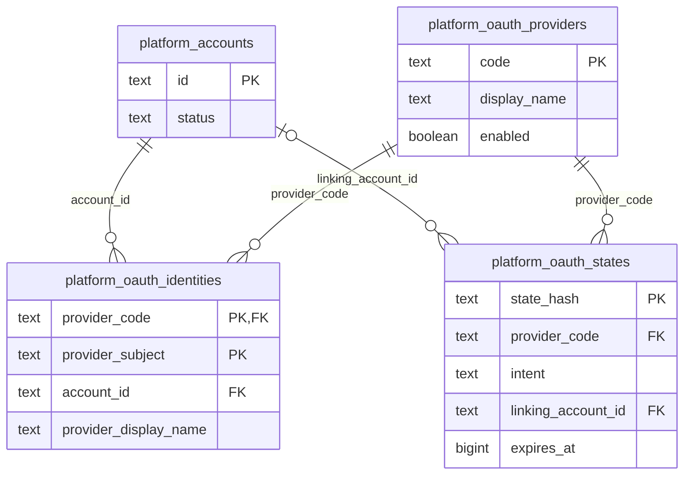
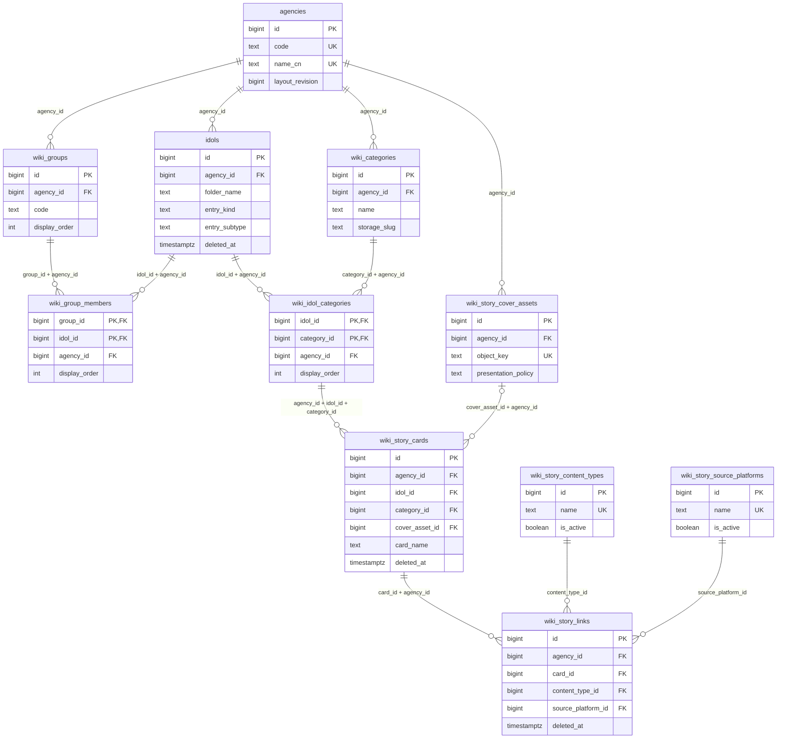
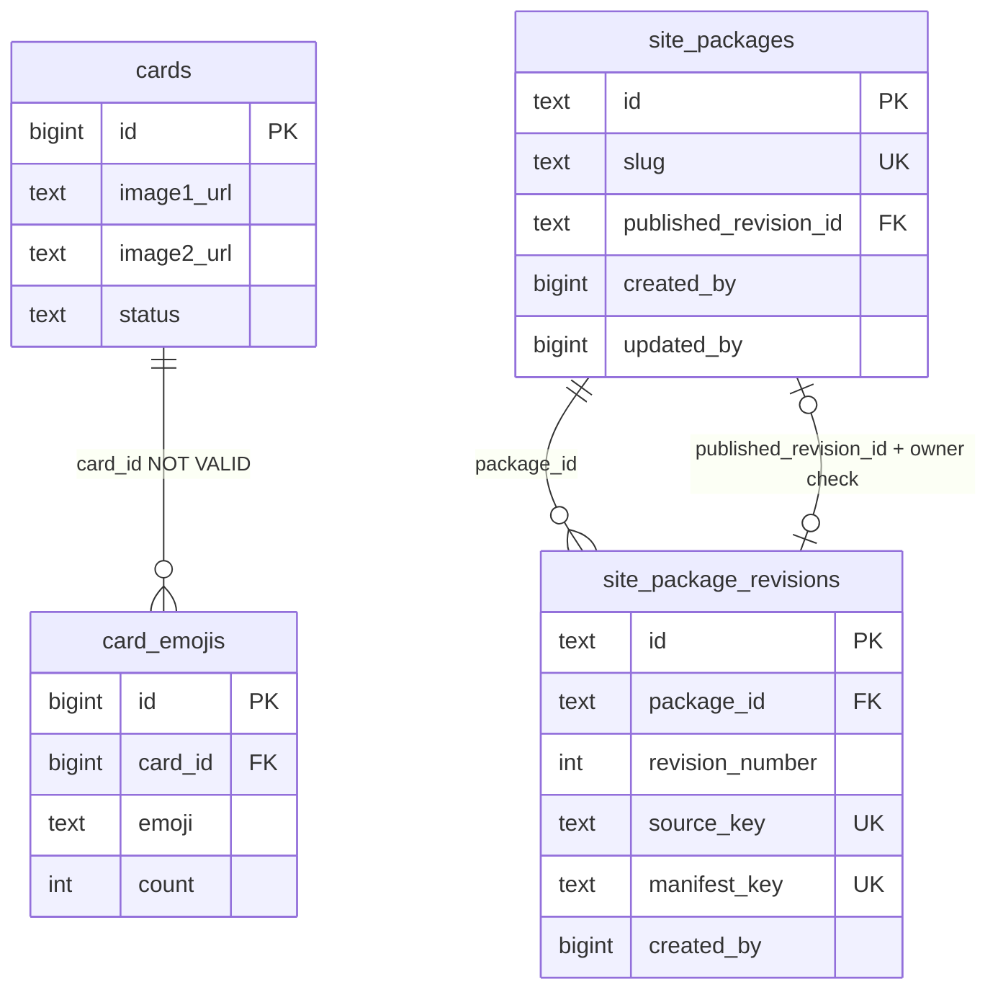
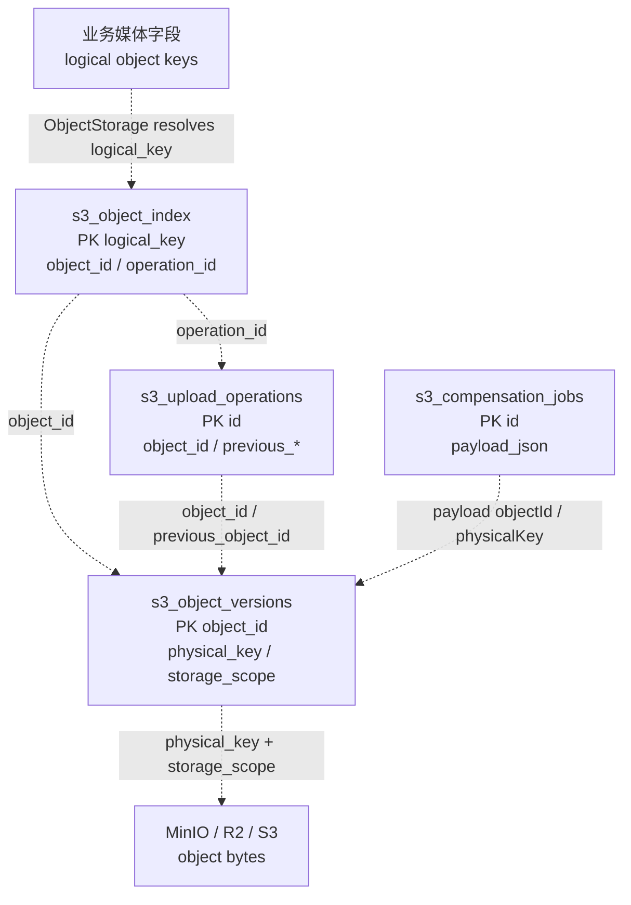
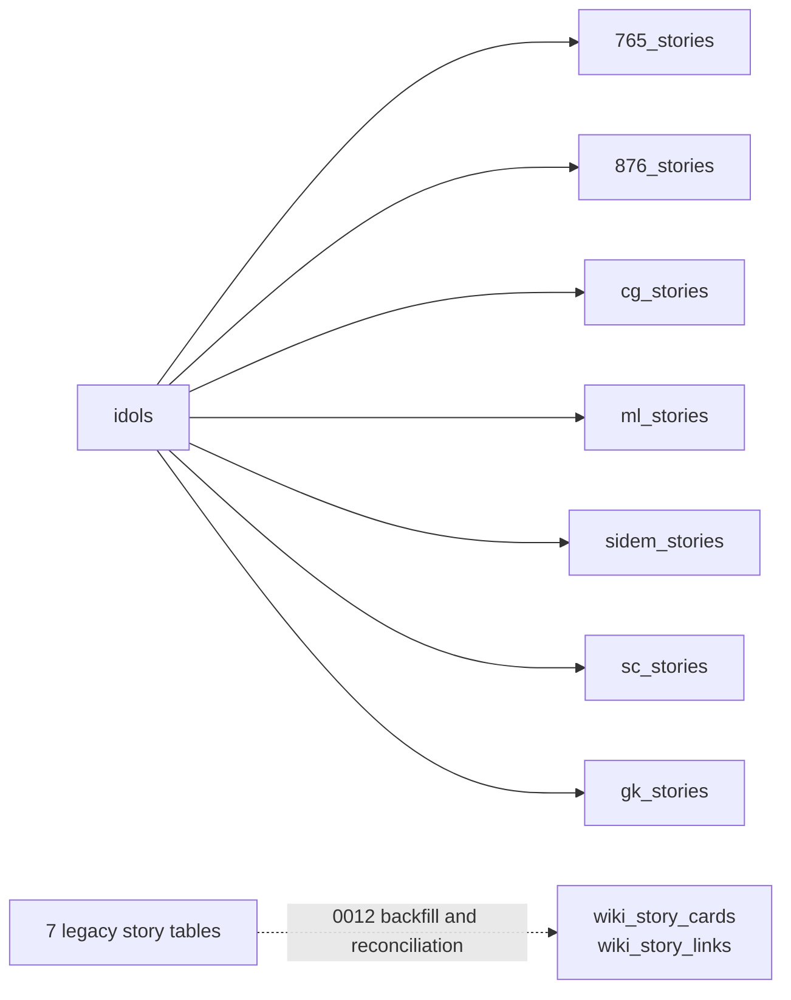

# PostgreSQL 表关系图

## 版本边界

本文描述当前正在开发的 Fudaba Platform 迁移工作树，而不是纯 `main` 或生产数据库：

| 项目 | 值 |
| --- | --- |
| 分支 | `codex/fudaba-platform-migration` |
| 提交 | `14254d4a77f9f00a599f76d0dc517306dc0f7632` |
| 基线 | `main@2216bd5f224cfd14cc20a90db6446a2aa4c68002` |
| PostgreSQL 终态 migration | `0021_backoffice_persistence_names` |
| 结构规模 | 43 张物理表、2 个兼容视图、33 条数据库外键 |

结构以 `apps/api/migrations/postgresql/0001` 至 `0021` 为权威来源，并在隔离的
PostgreSQL 18.4 空库完整应用后，从 `pg_catalog` 与 `information_schema` 反查确认。
这只能证明该提交期望的 schema，不代表生产库已经迁移到 `0021`。

当前版本已经落地 Platform 身份、资料、OAuth、邮箱凭据和会话基础表，但尚未创建
`fudaba_*` 办公室、名片、点赞、收藏等业务表。

相对基线 `main@2216bd5`（终态 `0019_homepage_links`），这个工作树增加了 8 张
`platform_*` 表，并把 `users`、`auth_refresh_sessions` 两张物理表分别改名为
`backoffice_accounts`、`backoffice_refresh_sessions`；旧名称保留为 2 个单表可更新兼容视图。
因此纯 `main` 是 35 张物理表，本工作树终态是 43 张。

## 图例

- `PK`、`FK`、`UK` 分别表示主键、数据库外键和唯一约束。
- ER 图中的实线全部是 PostgreSQL 实际约束；复合外键在连线文字中标出。
- `||` 表示恰好一个，`o|` 表示零或一个，`o{` 表示零或多个。
- 对象存储图中的虚线是应用层逻辑键，不是数据库外键。
- 为保持关系层级清晰，实体只列主键、外键、关键唯一键和状态字段，不是完整字段字典。

## 全局分层

## Backoffice 与 Platform 身份

Backoffice 和 Platform 是两套相互隔离的身份域：前者使用数字账号 ID 和管理角色，后者使用
文本 UUID、独立的 token version、OAuth/邮箱凭据及安全事件。两套账号之间没有外键。

Platform 账号的主体资料、会话、邮箱凭据和安全事件均直接归属于账号：

OAuth 身份和一次性 state 同时受 Provider 目录与 Platform 账号边界约束：

`users` 和 `auth_refresh_sessions` 在 `0021` 后是为滚动部署保留的单表可更新兼容视图，分别投影
`backoffice_accounts` 和 `backoffice_refresh_sessions`。它们不计入 43 张物理表；当前代码应使用
`backoffice_*` 物理表名，旧 release 才通过兼容视图维持短期读写能力。

## Wiki 规范化主链

[独立 SVG：Wiki 表关系图](diagrams/wiki-table-relationships.svg)

物理表名 `idols` 在业务上表示“内容页”。栏目与内容页、内容页与分类都是多对多关系；桥接表
携带 `agency_id` 的复合外键，阻止跨企划关联。

`theme_colors(name PK, color)` 是运行时仍会读取的独立主题色表，但没有指向企划、内容页或分类的
数据库外键。

## 公共内容与站点包

- `card_emojis.card_id` 是 `NOT VALID` 外键：新写入受约束，但历史孤立记录尚未被该约束证明有效。
- `site_packages.published_revision_id` 同时受普通外键和
  `(id, published_revision_id) -> (package_id, id)` 复合外键约束，保证只能发布本包版本。
- `site_packages.created_by/updated_by`、`site_package_revisions.created_by` 保存 Backoffice
  账号 ID，但当前没有数据库外键；`logs` 和 `news.author` 保存文本快照，也不与账号表建立外键。
- `news(id PK, author, image, thumbnail)`、`events(id PK, name, image_url)`、
  `homepage_links(id PK, section, display_order)` 和
  `logs(id PK, username, producername, action)` 彼此独立，因此不画伪关系线。

## 对象存储控制面

四张 `s3_*` 表刻意没有数据库外键。上传状态机在事务中维护这些逻辑关系，以允许对象版本、当前
指针和补偿任务按状态分阶段写入。

`s3_upload_operations.previous_operation_id` 还会在应用层自引用前一次上传操作；为避免自环遮挡主路径，
该逻辑关系未在图中另画一条线。

业务逻辑键主要来自 `news`、`events`、`cards`、`agencies`、`wiki_groups`、`idols`、
`wiki_story_cards`、`wiki_story_cover_assets`、`site_package_revisions` 和
`platform_profiles`。这些列也必须兼容本地文件存储，因此不直接外键到 `s3_object_index`。

## 历史剧情表

七张表的 `idol_id` 都有真实外键指向 `idols.id`。它们在 `0012` 后仅保留为迁移与双向对账证据；
当前 Wiki 运行时的写入源是 `wiki_story_cards` 与 `wiki_story_links`。

## 完整物理表清单

| 分层 | 数量 | 物理表 |
| --- | ---: | --- |
| Backoffice 身份 | 2 | `backoffice_accounts`, `backoffice_refresh_sessions` |
| Platform 身份 | 8 | `platform_accounts`, `platform_profiles`, `platform_oauth_providers`, `platform_oauth_identities`, `platform_oauth_states`, `platform_refresh_sessions`, `platform_email_credentials`, `platform_security_events` |
| 公共内容与审计 | 6 | `news`, `events`, `cards`, `card_emojis`, `homepage_links`, `logs` |
| 站点包发布 | 2 | `site_packages`, `site_package_revisions` |
| Wiki 规范化运行时 | 12 | `agencies`, `idols`, `wiki_groups`, `wiki_group_members`, `wiki_categories`, `wiki_idol_categories`, `wiki_story_cards`, `wiki_story_links`, `wiki_story_content_types`, `wiki_story_source_platforms`, `wiki_story_cover_assets`, `theme_colors` |
| Wiki 历史剧情 | 7 | `765_stories`, `876_stories`, `cg_stories`, `ml_stories`, `sidem_stories`, `sc_stories`, `gk_stories` |
| S3 控制面 | 4 | `s3_object_versions`, `s3_object_index`, `s3_upload_operations`, `s3_compensation_jobs` |
| 迁移元数据 | 2 | `ims_schema_migrations`, `ims_data_migrations` |
| **合计** | **43** | 不含 2 个兼容视图 |

兼容视图为 `users` 和 `auth_refresh_sessions`。迁移元数据表不指向业务表：
`ims_schema_migrations` 记录 migration 版本与 checksum，`ims_data_migrations` 记录历史数据导入源与
对账摘要。
