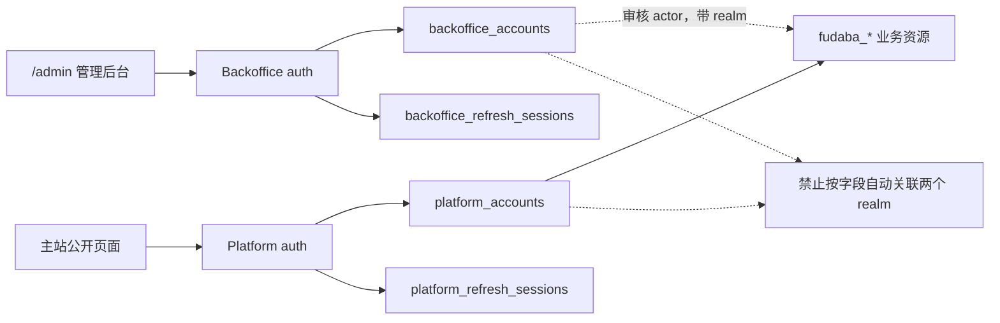

# Fudaba 主站迁移合同

本文定义 Fudaba 合入 IMSWeb 的目标架构、提交顺序、数据与路由映射、素材授权门禁、上线与回滚
步骤，以及每一阶段必须保存的验收证据。它是实现和发布的约束，不是对旧仓库目录结构的复制清单。

文中的“必须”表示合并或切流前的阻断条件；“不得”表示迁移期间也不能临时突破的边界。若实现需要
偏离本文，必须先在同一 PR 中更新本文并说明数据、安全和回滚影响。

## 1. 迁移目标与固定边界

迁移完成后，IMSWeb 是唯一应用运行时和公开入口：

- Web 继续使用 React Router 7，页面实现位于 `apps/web/app/pages/`；
- API 继续使用 Hono Node，领域实现位于 `apps/api/src/domains/`；
- PostgreSQL 保存身份、会话和 Fudaba 业务元数据；
- 名片、头像和事务所封面通过现有 `ObjectStorage` 状态机进入同一 S3-compatible bucket；
- Cloudflare R2 只能作为 S3-compatible 数据面，不能把 Worker binding 或 D1 带入活动运行时；
- 主站后台身份和平台用户身份是两个独立帐号体系；
- Fudaba 是平台帐号的首个业务消费者，不是平台帐号的命名空间或所有者。

迁移不得：

- 把 Fudaba 的 Vite 应用作为 iframe、站点包或第二套 SPA 长期挂载；
- 把 Fudaba 的 Worker、D1 repository 或 R2 binding 原样复制到 IMSWeb domain；
- 让 platform 业务依赖 Backoffice JWT、`dept`、`admin_role` 或管理员刷新会话；
- 复用现有 `cards` 表、`/api/cards` 或 `/community/cards` 表达 Fudaba 名片；
- 把仓库 demo seed 当作生产数据迁移输入；
- 在未通过授权门禁前复制官方角色图、系列标识、公开名片案例或用户上传内容；
- 修改已经发布的 PostgreSQL migration；所有数据库变化都使用新的 forward migration。

## 2. 基线与来源锁定

### 2.1 IMSWeb 基线

本文编写时，IMSWeb PostgreSQL migration 最新版本为
`0019_homepage_links`。当前帐号数据位于 `public.users`，其中 `editor` 和 `op` 都是后台工作身份；
`admin_role` 只为 `op` 补充 `admin | super_admin` 层级。刷新会话位于
`public.auth_refresh_sessions`。

以下既有公开语义必须保留：

| 既有表面 | 当前责任 | 迁移决定 |
| --- | --- | --- |
| `/community` | 主站社区入口 | 保留，并增加 Fudaba 入口 |
| `/community/cards` | 经过运营审核的旧双面名片墙 | 保留，不直接转换为 Fudaba 所有权数据 |
| `/producer-map` | 地区与社群信息地图 | 保留，不与 Fudaba 事务所地图合并 |
| `GET /api/cards` | 旧名片公开分页 | 保留 |
| `POST /api/uploadNameCard` | 旧匿名/审核式名片投稿 | 保留到单独产品决策 |
| `/api/reactions`、`/api/emojis` | 旧名片表情计数 | 保留 |
| `public.cards` | 旧审核式名片记录 | 保留，Fudaba 不写入此表 |

### 2.2 Fudaba 来源

迁移输入固定为：

- 仓库：<https://github.com/imas-fan-dev/Fudaba>
- 分支：`main`
- 审计提交：`544d362acfb7af28d90f9a9e59f3a8757661dd77`
- 审计日期：2026-08-01

每次导入都必须把实际来源 commit、D1 数据库标识、R2 bucket、导出时间和导出文件 SHA-256
写入迁移 manifest。若来源 commit 变化，应重新生成差异清单，不能继续沿用本文对旧 snapshot 的
表、路由和素材结论。

该 snapshot 是 React 19 + Vite Web、Hono Worker API、D1 和 R2 的 MVP。其表结构由
`apps/api/migrations/0001_initial.sql` 至 `0010_email_credentials.sql` 定义，包含用户、OAuth、
邮箱凭据、事务所、系列标签、名片、墙面位置、留言、交换、点赞和收藏。

## 3. 两个独立帐号体系



### 3.1 Backoffice 身份域

Backoffice 覆盖所有现有后台工作身份，包括 `editor`、普通 `op`、`admin` 和 `super_admin`。
“管理员帐号”不能只理解为 `dept='op'`，否则会丢失 Wiki 编辑帐号。

终态约束：

- 代码类型、repository port、Hono context、中间件和 token service 统一使用 `Backoffice*` 命名；
- 物理表终态为 `backoffice_accounts` 和 `backoffice_refresh_sessions`；
- 物理迁移保留所有数字 ID，避免站点包 actor、日志和已签发 JWT 发生归属漂移；
- `site_packages.created_by/updated_by` 和 `site_package_revisions.created_by` 的身份域明确为
  Backoffice；后续新增审计列必须同时保存 actor realm；
- 管理后台使用独立密钥、JWT audience、Cookie 和 Alova client；
- 删除帐号必须撤销刷新会话；已签发 access token 的最长残留时间需要在 UI 和运维文档中明示。

物理改名必须使用新的 post-data migration，并为上一个 release 提供只读和写入兼容面。PostgreSQL
在重命名后保留单表可更新 compatibility view。SQLite 兼容模式分两阶段：上一个 release 的观察期内，
`users/auth_refresh_sessions` 仍是唯一物理写入源，`backoffice_*` 是只读新命名视图，新 repository 按
SQLite dialect 定向旧物理表；观察期结束后，再用独立 forward migration 完成 SQLite 物理改名。
这是因为 SQLite `INSTEAD OF` view trigger 不保留旧 repository 依赖的 `RETURNING` 与受影响行数
语义。不能提前重命名 SQLite 物理表，导致普通代码回滚时 refresh CAS、帐号创建或删除误判失败。

### 3.2 Platform 身份域

Platform 服务主站普通用户，使用文本 UUID，不复用 Backoffice 数字 ID。最低数据模型如下：

| 表 | 必需字段与约束 |
| --- | --- |
| `platform_accounts` | `id TEXT PK`、`status`、`token_version`、`created_at`、`updated_at`、`deleted_at`；status 仅允许 `active/restricted/suspended/deleted` |
| `platform_profiles` | `account_id PK/FK`、`display_name`、`avatar_object_key`、`avatar_external_url`、`home_city`、`bio`、`updated_at` |
| `platform_oauth_providers` | `code PK`、`enabled`、展示名；首批为 `google/github`，provider 不得只存在于代码常量 |
| `platform_oauth_identities` | `(provider_code, provider_subject) PK`、`account_id FK`、provider 用户名/头像快照、时间；`UNIQUE(account_id, provider_code)` |
| `platform_oauth_states` | `state_hash PK`、provider、`intent`、可空 linking account、PKCE verifier、站内 return path、过期与创建时间 |
| `platform_refresh_sessions` | `id PK`、`account_id FK`、当前/前一 token hash、CSRF hash、过期/撤销/创建/更新时间；对 `account_id` 和 expiry 建索引 |
| `platform_email_credentials` | `normalized_email PK`、`account_id UNIQUE FK`、算法名、参数、salt、hash、更新时间；用于兼容 Fudaba 邮箱帐号 |
| `platform_security_events` | account、event、request metadata、时间；不得记录 OAuth access token、明文刷新 token 或验证码 |

平台资料与 provider 快照必须分离。再次 OAuth 登录可以更新 identity snapshot，但不得覆盖用户手工
修改过的 `platform_profiles`。

### 3.3 不可跨越的身份边界

| 项目 | Backoffice | Platform |
| --- | --- | --- |
| JWT secret | `IMS_BACKOFFICE_JWT_SECRET` | `IMS_PLATFORM_JWT_SECRET` |
| JWT audience | `ims-backoffice` | `ims-platform` |
| JWT principal | 数字帐号 ID、`kind=backoffice` | 文本 UUID、`kind=platform` |
| Access Cookie | `ims_admin_access` | `ims_platform_access` |
| Refresh Cookie | `ims_admin_refresh` | `ims_platform_refresh` |
| CSRF Cookie | `ims_admin_csrf` | `ims_platform_csrf` |
| Hono context | `backofficeUser` | `platformUser` |
| API client | `adminApiClient` | `platformApiClient` |
| 登录入口 | `/api/admin/auth/*` | `/api/platform/auth/*` |
| 可拥有 Fudaba 资源 | 否 | 是 |
| 可执行 Fudaba 审核 | 是 | 否 |

生产环境两个 JWT secret 必须不同。验证必须固定算法并检查 `iss`、`aud`、`kind`、过期时间和
token version；不能仅凭 claims 的字段形状判断 realm。同一个自然人可以分别拥有两类帐号，但
系统不得按邮箱、provider subject、用户名或头像自动关联两个 realm。

Web 不得继续让任意 API 的 `401` 触发同一个 `/api/refresh`。管理员和平台请求分别使用 Alova
token-authentication 支持，只能调用本 realm 的刷新端点；匿名公开 client 不自动刷新任何会话。

## 4. Platform OAuth 合同

目标 API：

| 方法与路径 | 责任 |
| --- | --- |
| `GET /api/platform/auth/providers` | 返回数据库启用且运行时密钥完整的 provider |
| `POST /api/platform/auth/oauth/:provider/start` | 创建 login state，返回 provider authorization URL |
| `POST /api/platform/auth/oauth/:provider/link` | 已登录平台用户创建 link state；要求 platform CSRF |
| `GET /api/platform/auth/oauth/:provider/callback` | 原子消费 state，解析 identity，建立平台会话并跳回站内路径 |
| `GET /api/platform/auth/session` | 返回当前平台帐号和资料；未登录返回 401 |
| `POST /api/platform/auth/refresh` | 轮换 platform refresh/CSRF，不读取 Backoffice Cookie |
| `POST /api/platform/auth/logout` | 撤销当前 platform session 并清理 platform Cookie |

OAuth 安全要求：

- state 只保存 SHA-256，默认 10 分钟过期，callback 使用单条原子 delete-returning 消费；
- Google 使用 PKCE，所有 provider 都校验 state 和 callback provider 一致；
- `returnTo` 只接受以单个 `/` 开始的站内路径，拒绝绝对 URL、`//`、反斜杠、控制字符和
  `/admin`；
- 只请求完成身份识别所需的最小 scope；不得持久化第三方 access/refresh token；
- provider subject 是唯一身份键，显示名和邮箱不能用作合并键；
- linking 时，目标 identity 已属于其他 platform account 必须失败并记录安全事件；
- suspended/deleted account 不能通过 OAuth 自动恢复；
- 登录、callback、刷新、验证码、上传和写接口必须分别限流；
- OAuth callback 错误只能返回稳定公开错误码，provider 原始错误和 token 不进入前端 URL。

GitHub OAuth App 只允许一个 callback URL。新旧站并行时必须创建独立 OAuth App，或者安排冻结
窗口切换 callback；不能假设一个 GitHub OAuth App 可同时配置两个地址。见
[GitHub 官方说明](https://docs.github.com/en/apps/oauth-apps/building-oauth-apps/creating-an-oauth-app)。

## 5. Fudaba 目标数据模型

Fudaba 业务表统一使用 `fudaba_*` 前缀，避免与 IMSWeb 旧 Core 表发生同名冲突：

| 目标表 | 所有者与关键约束 |
| --- | --- |
| `fudaba_offices` | owner FK 指向 `platform_accounts`；slug 唯一；坐标范围、状态与归档时间受约束 |
| `agencies` | Wiki 与 Fudaba 共享的唯一企划目录；稳定 code、名称、颜色、排序、启用状态、图标和裁切参数统一维护 |
| `fudaba_office_series_tags` | `(office_id, series_code) PK`，保存排序 |
| `fudaba_cards` | owner FK 指向 platform；正反面保存对象逻辑键；保留来源、可交换状态与软删除时间 |
| `fudaba_office_cards` | `(office_id, card_id) PK`，保存 pinned time、x/y、rotation、z-index |
| `fudaba_messages` | office、platform author、1..280 字、创建与隐藏时间 |
| `fudaba_exchange_requests` | requester/recipient/office/目标与提供名片 FK；状态机和更新时间受约束 |
| `fudaba_card_likes` | `(card_id, account_id) PK` |
| `fudaba_card_favorites` | `(card_id, account_id) PK` |
| `fudaba_moderation_cases` | resource kind/id、reason、state、Backoffice actor 与时间 |

所有 ownership 检查由 repository 条件写和数据库 FK/constraint 共同保证。不得先查询 owner 再执行
无 owner 条件的 update。事务所归档后，不允许新增墙面名片、留言或交换请求；恢复需要 owner 或
Backoffice 审核权限。

### 5.1 D1 到 PostgreSQL 映射

生产迁移输入来自实际 D1 导出，不来自 `seed.sql`。映射顺序固定如下：

| Fudaba 来源 | IMSWeb 目标 | 转换规则 |
| --- | --- | --- |
| `users` | `platform_accounts` + `platform_profiles` | 保留文本 ID；创建 `active` account；资料字段分离；demo/synthetic 用户默认排除 |
| `oauth_accounts` | `platform_oauth_identities` | `provider_user_id -> provider_subject`；保留快照；不得导入 provider token |
| `sessions` | 不迁移 | 所有用户在主站重新认证 |
| `oauth_states` | 不迁移 | 临时 state 不跨系统、不跨部署恢复 |
| `email_credentials` | `platform_email_credentials` | 标记 `pbkdf2-sha256`、100000 iterations；首次成功登录后重哈希为目标算法 |
| `offices` | `fudaba_offices` | 保留 ID/slug；INTEGER boolean 转 BOOLEAN；ISO 时间转 `TIMESTAMPTZ`；媒体 URL 经 manifest 映射 |
| `series_tags` | `agencies` 对账输入 | 只用于把来源显示名解析到 canonical agency code；不再落独立运行时目录表 |
| `office_series_tags` | `fudaba_office_series_tags` | series display name 转稳定 code，保留 sort order |
| `cards` | `fudaba_cards` | 保留 ID/owner/source 字段；媒体 URL 转对象逻辑键；无授权媒体不得进入公开状态 |
| `office_cards` | `fudaba_office_cards` | 保留位置；x/y 必须在 0..100，rotation 和 z-index 使用目标约束 |
| `messages` | `fudaba_messages` | 保留 ID/author/content/time；作者缺失直接阻断，不创建匿名替身 |
| `exchange_requests` | `fudaba_exchange_requests` | 保留 ID 与状态；四类 account/card FK 必须全部通过 |
| `card_likes` | `fudaba_card_likes` | 保留复合唯一关系，不能转换成匿名计数 |
| `card_favorites` | `fudaba_card_favorites` | 保留复合唯一关系 |

Fudaba 邮箱密码使用 PBKDF2-SHA256、100000 iterations 和独立 salt。迁移器不得把已有 hash 当作
明文重新 bcrypt。目标 verifier 在兼容窗口识别算法，成功验证后使用 IMSWeb 现有 bcrypt adapter
以 cost 12 原子升级，并把算法字段改为 `bcrypt`；若实现不提供兼容 verifier，则必须采用密码重置
流程，不能静默丢弃帐号或降低哈希强度。密码哈希 capability 可以复用，credential repository、帐号、
会话和 Cookie 仍必须按 realm 隔离。

首批系列标签映射固定如下；新增值先经内容 owner 审核，再增加稳定 code，不能在 importer 内临时
slugify：

| 来源显示名 | 目标 code |
| --- | --- |
| `本家 / 765AS` | `765` |
| `灰姑娘女孩` | `cg` |
| `百万现场` | `ml` |
| `SideM` | `sidem` |
| `闪耀色彩` | `sc` |
| `学园偶像大师` | `gk` |
| `vα-liv` | 无自动映射；有关联数据时阻断并人工对账，绝不能映射为 `876` |

时间转换必须拒绝非法值；不能以“当前时间”替代损坏时间。ID、slug、邮箱、provider subject、
对象 key 和来源 URL 均按原值生成映射清单，冲突必须进入 reconciliation report，不能自动加后缀。

### 5.2 Demo 与真实数据

Fudaba 仓库的 `seed.sql` 含合成用户、演示事务所、演示留言、预置访问量和示例名片，不得导入
生产。导出器必须给每条数据标注来源类别：

- `production-user-content`：用户真实创建，进入授权与完整性检查；
- `owner-approved-reference`：有明确转载/运营授权，可按授权范围导入；
- `demo-or-synthetic`：仅供测试环境；
- `unknown`：阻断生产导入。

生产 `visitor_count` 只有在能够证明它来自真实计数规则时才迁移；seed 值和无法说明口径的值归零，
并在 report 中保存原值，不能作为主站真实指标展示。

来源仓库没有独立的 visit/check-in 表、用户到访写路由或去重规则；`visitor_count` 只是事务所上的
展示与排序字段。因此地图选点创建事务所属于迁移范围，用户到访打卡、印章或排行属于新增产品
能力，必须另行定义位置证明、幂等、防刷、撤销、隐私与审核合同，不能把静态访问量冒充打卡记录。

## 6. 媒体与素材授权门禁

### 6.1 代码许可

审计 snapshot 根目录没有 `LICENSE`、`COPYING` 或 `NOTICE`。公开可读不等于获得复制、修改和
再分发许可。复制任何 Fudaba 实现前，仓库所有者必须完成下列一种操作，并把证据链接写入 PR：

1. 为 Fudaba 增加与 IMSWeb 兼容的许可证；或
2. 由全部相关权利人提供可审计的迁移授权和归属说明。

门禁未完成前可以基于公开行为重新实现接口和数据合同，但不得整文件复制代码、CSS、设计文档或
生成产物。

### 6.2 素材分类

| Fudaba 素材 | 默认迁移决定 | 放行证据 |
| --- | --- | --- |
| `public/demo-cards/source-official/*`、由其生成的 demo cards | 排除生产 | 官方许可或替换为已授权用户上传 |
| `public/brand-icons/*` 官方系列标识 | 排除生产副本 | 商标/著作权使用确认，并登记 `docs/ASSET_PROVENANCE.md` |
| `public/reference-cards/*` 公开案例 | 排除生产二进制 | 作者明确转载许可；只有公开网页不构成再授权 |
| `public/sample/*` 与 demo seed | 仅测试 | 来源许可证逐项核验；生产仍不得导入 synthetic content |
| `public/office-covers/*` | 逐项审计 | 原图/生成输入、许可证、转换链和 SHA-256 完整 |
| `public/generated/*`、`output/imagegen/*` | 条件允许 | prompt、生成工具、日期、输入素材与使用权登记完整 |
| 实际 R2 用户上传 | 条件允许 | 用户条款、迁移通知、公开授权、投诉/删除入口和数据处理记录 |

所有进入 `apps/web/public/` 的文件必须登记到 `docs/ASSET_PROVENANCE.md`。业务媒体默认不提交
Git，使用被忽略的 `data/migration/fudaba/` staging 和对象存储状态机。

### 6.3 对象 key 与迁移 manifest

目标逻辑 key：

```text
community/fudaba/accounts/{accountId}/avatar.{ext}
community/fudaba/offices/{officeId}/cover.{ext}
community/fudaba/cards/{cardId}/front.{ext}
community/fudaba/cards/{cardId}/back.{ext}
system/migrations/fudaba/{sourceCommit}/{manifestSha256}.json
```

每个对象的 manifest 至少包含：来源 bucket/key 或 URL、业务实体、素材类别、授权状态、字节数、
MIME、SHA-256、目标逻辑 key、目标物理 object ID、写入状态和回读 SHA-256。迁移顺序必须为：

1. 下载至被忽略的 staging；
2. MIME sniff、图片解码、尺寸和大小校验；
3. 生成清单并人工完成授权分类；
4. 通过 `ObjectStorage` 写入受保护版本并从目标回读哈希；
5. PostgreSQL 事务写入业务记录和逻辑 key；
6. 审核通过后发布为 public ready 版本；
7. 最后写入审计 manifest。

不得先发布公开对象再补数据库，也不得把旧 `/media/*` URL 直接存入目标表。删除或替换媒体必须
走现有版本与补偿机制，回滚代码时不删除仍有 manifest 引用的对象。

## 7. 路由映射与冲突处理

Platform 是身份 namespace，Community Exchange 是业务 namespace。Fudaba 业务路由不得放在
`/api/platform/community/*`，以免把业务生命周期耦合到认证实现。

### 7.1 API 映射

| Fudaba 旧路径 | IMSWeb 目标路径 | 说明 |
| --- | --- | --- |
| `GET /health` | `GET /api/health` | 建立统一 health；`/api/wiki/test` 只保留兼容期 |
| `GET /api/auth/providers` | `GET /api/platform/auth/providers` | 独立平台 auth |
| `GET /api/auth/:provider` | `POST /api/platform/auth/oauth/:provider/start` | 返回 authorization URL |
| `GET /api/auth/:provider/callback` | `GET /api/platform/auth/oauth/:provider/callback` | 新 callback 和 state store |
| `DELETE /api/auth/session` | `POST /api/platform/auth/logout` | 统一 mutation/CSRF 语义 |
| `GET/PUT /api/me` | `GET/PUT /api/platform/me` | 平台资料，不是 Backoffice account |
| `GET /api/me/favorites` | `GET /api/community/exchange/me/favorites` | Fudaba 业务视图 |
| `GET /api/me/offices` | `GET /api/community/exchange/me/offices` | Fudaba 业务视图 |
| `PUT /api/me/cards/:id` | `PUT /api/community/exchange/me/cards/:id` | owner 条件写 |
| `GET /api/offices` | `GET /api/community/exchange/offices` | 避免与 producer-map 混淆 |
| `GET /api/offices/:id` | `GET /api/community/exchange/offices/:officeSlug` | 事务所详情聚合；公开路径使用稳定 slug |
| office 创建、更新、封面、归档、恢复、留言 | `/api/community/exchange/offices/*` | 逐个保留 HTTP 方法和资源语义 |
| `PUT /api/uploads/:side` | `PUT /api/community/exchange/uploads/:side` | 走 IMS ObjectStorage，不直写 R2 binding |
| `POST /api/cards` | `POST /api/community/exchange/cards` | 不占用现有 `POST/GET /api/cards` |
| card placement/like/favorite | `/api/community/exchange/offices/*`、`/api/community/exchange/cards/*` | platform auth + CSRF |
| `POST /api/exchanges` | `POST /api/community/exchange/requests` | 为后续接受/拒绝/取消保留 namespace |
| `GET /api/locations/search` | `GET /api/community/exchange/locations/search` | 代理外部 geocoder，独立限流与缓存 |
| `GET /media/*` | 现有稳定业务 URL/CDN 解析 | 不注册第二套通用媒体通配路由 |

所有 endpoint schema、调用、CSRF 和响应解析只能位于 `apps/web/app/lib/api/`。页面不得直接
`fetch`，也不得从 Fudaba 复制 page-local API client。

### 7.2 首批公开读合同

首批只读实现注册 `GET /api/community/exchange/series`、`offices`、`offices/:officeSlug` 和
`cards`。所有路由由 `IMS_FUDABA_PUBLIC_READ_ENABLED` 统一控制，默认 `false`；关闭时返回 404，
不能只在 Web 隐藏入口。该阶段不注册任何 Fudaba mutation。

公开查询必须同时满足以下约束：

- 事务所为 `active`，名片为 `published`、素材授权为 `approved` 且未删除；
- owner 帐号为 `active` 或 `restricted`；`suspended/deleted` owner 的资源 fail-closed；
- disabled series 不出现在系列、事务所标签或名片结果中；
- 未携带 Platform 凭据时按匿名读取；一旦携带凭据就完整验证 realm、session、帐号状态和 token
  version，失败不得降级为匿名；Backoffice Cookie 不参与 Platform viewer 判定；
- repository 可以持有逻辑 object key，但 HTTP 响应只能返回经 `ObjectStorage` 验证的公开 URL；
- 开启读取开关时必须使用 S3-compatible storage 并配置 `IMS_PUBLIC_READ_URL_BASE`，否则应用启动
  失败；filesystem 兼容适配器不提供逻辑对象键的公开读取能力；
- 响应不包含 owner ID、精确地址、经纬度、逻辑 object key 或审核字段，并使用
  `Cache-Control: private, no-store`；
- office/card 游标绑定筛选条件并使用确定性 tie-break。事务所当前按可变的 `visitor_count` 排序，
  因此游标不提供跨请求快照一致性；地图上线前应改用快照游标或不可变排序键。

精确地址和坐标不能直接用于公开地图；它们只留在 owner/Backoffice 数据面。metadata importer
还会把迁移名片固定写为 `draft`、媒体固定写为 `ready/private`，所以仅开启 read flag 不会公开
迁移内容；只有完成逐项授权、发布和 reconciliation 后才能开放。

### 7.3 审核后的区域地图合同

公开地图使用独立的 `fudaba_office_public_locations` 投影，不从事务所精确坐标自动回填。owner
显式提交后由 Backoffice 审核；公开 DTO 只能返回 0.1 度网格位置、`precision='regional'` 和公开
事务所摘要，不得返回 owner、reviewer、审核说明、精确地址或精确坐标。

首版区域投影只接受纬度 `-60..60`。这是隐私边界，不是地图引擎限制：纬度越接近极点，0.1 度
经度对应的物理距离越小，若允许到 `±90` 就会把“区域位置”退化为近似精确位置。超出此范围的
事务所仍可使用目录与精确 owner 管理面，但不能提交公开地图点。未来扩展全球范围必须改用固定
物理尺寸网格并重新做隐私评审，不能只放宽数据库 check。

地图端点为 `GET /api/community/exchange/map/config` 和
`GET /api/community/exchange/map/offices?bbox=...`：

- 必须同时开启 `IMS_FUDABA_PUBLIC_READ_ENABLED` 和 `IMS_FUDABA_MAP_ENABLED`；任一关闭均返回 404；
- `bbox` 必填、V1 拒绝跨日期变更线单框，客户端拆成两个请求；服务端先量化为整数边界再查询；
- 样式 URL 只能是无 query/hash、反斜杠、控制字符或双斜杠的同源绝对路径；样式、tile、glyph 和
  sprite 均由部署方在同源托管，代码不得硬编码第三方 provider 或密钥；
- 公开点只来自 `published` 审核状态；owner 重提恢复为 `pending`，撤回会立即删除公开投影；
- 审核 CAS 与 Backoffice audit log 必须在同一数据库事务提交，且每次请求重新确认当前操作员仍
  存在并属于 `op`，不能只信任 access token 中的旧 `dept`；
- 地图 IP、位置写入 IP 和位置写入帐号限流使用 PostgreSQL/SQLite 持久窗口；生产多副本不得退回
  进程内 `Map` 计数。

此处的“地图点”是事务所发现和选点，不是用户到访打卡。visit/check-in、印章与排行仍受第 5.2
节的独立产品合同约束。

### 7.4 Platform 资料与名片写合同

帐号资料与名片管理不能依赖公开读取开关。`GET /api/platform/me` 和本人名片读取要求有效的
Platform session；`PUT /api/platform/me`、名片 mutation 和
`PUT /api/community/exchange/uploads/:side` 还要求 `active` 帐号、Platform CSRF、IP/帐号双维度
限流以及 `IMS_FUDABA_WRITE_ENABLED=true`。`restricted` 帐号可以继续读取，但不能写入。

`POST /api/community/exchange/cards` 使用一个 multipart 请求作为事务边界：只接收一张 `front`、
一张 `back` 和名片字段，依次校验扩展名、声明 MIME 与解码内容，转换为 WebP 并写入受保护对象，
然后创建 owner-scoped 记录。`uploads/:side` 只允许 `avatar`、`front`、`back`，并在同一请求内使用
`expectedUpdatedAt` 或 `expectedRevision` 替换已有资源；它不是通用预上传或 raw object key 认领接口。

运行期替换始终生成唯一 object key。owner/CAS 写入失败时只能删除本请求创建的对象；成功时先提交
数据库引用，再通过补偿机制删除旧对象。客户端不得提交 owner ID、逻辑 object key、来源证明、授权
状态、发布状态或服务端时间；用户新建或修改的名片固定进入 `pending/unknown`，等待 Backoffice 审核。

### 7.5 Web 路由

| 目标路径 | 页面责任 |
| --- | --- |
| `/community` | 保留社区 hub，按服务端开关增加“名片交换事务所”入口 |
| `/community/exchange` | 按城市、企划和开放状态发现事务所与公开名片；不读取精确坐标 |
| `/community/exchange/offices/:officeSlug` | 可分享、可回退的事务所详情 |
| `/community/exchange/me` | 平台资料、我的名片、事务所、收藏和交换请求 |
| `/community/exchange/auth/callback` | 只呈现 callback 结果；真正 OAuth callback 仍由 API 处理 |
| `/admin/community/exchange` | Backoffice 审核、举报和封禁工作台 |

动态公开路由必须同步更新 `app/routes.ts`、Hono frontend route policy、预渲染/SPA fallback 契约和
`pnpm run test:web-routing`。`/community/cards` 与 `/producer-map` 不重定向到新页面；是否以后合并
由独立产品和数据归属决策处理。

## 8. Web 与美术迁移

Fudaba 视觉稿和组件只作为功能与信息层级参考。目标页面必须遵守 IMSWeb `DESIGN.md`、公共布局、
i18n、shadcn/Base UI 和 Lucide 约定，不能并行维护第二套全局 reset、主题 token、导航或弹窗系统。

实现顺序：

1. 先移植信息架构、状态模型和交互流程，不复制全局 CSS；
2. 首批以目录发现作为 `/community/exchange` 的默认工作面；区域地图独立懒加载，并且只有在
   第 7.3 节的 migration、审核、隐私、持久限流和同源 tile 门禁全部满足后才启用；
3. 名片墙、详情翻面、上传、放置、收藏和交换使用 IMSWeb 组件与焦点管理；
4. 登录、空状态、错误、受限帐号、审核中、已归档和网络重试都要有真实页面状态；
5. 移动端首批验证目录筛选、事务所详情与公开名片；后续写入阶段再验证地图、名片上传、
   帐号入口和交换确认；
6. 所有可见素材先通过第 6 节门禁，再加入页面和截图。

若继续使用 MapLibre，应把依赖加入 `@imsweb/web` workspace，并把地图样式、第三方 tile/字体许可、
请求域名和隐私影响写入资产/运维文档。地点搜索不得公开精确家庭地址；创建事务所默认引导公共
场馆或地标，并提供举报和隐藏坐标流程。

## 9. 分阶段提交序列

每个提交必须可独立构建和验收。迁移文件、repository、运行时代码和对应测试应在同一提交中，
不得先提交不可执行 migration，随后再补实现。

### A. 合同与 Backoffice 显式化

1. `refactor(auth): isolate backoffice identity boundary`
   - 只做无行为变化的类型、port、context、中间件和 token service 命名；
   - `users` 和旧 Cookie 暂不变，先证明现有后台流程没有回归。
2. `docs(migration): define fudaba platform migration contract`
   - 本文；锁定来源 snapshot、边界、映射和门禁。
3. `refactor(web): isolate the administrator api client`
   - 建立 `adminApiClient`；只有管理员请求可以触发管理员 refresh；
   - 匿名 API client 不再把所有 401 解释为后台会话过期。
4. `refactor(auth): migrate backoffice persistence names`
   - PostgreSQL forward migration 将 `users/auth_refresh_sessions` 迁到
     `backoffice_accounts/backoffice_refresh_sessions`；SQLite 进入第 3.1 节的两阶段兼容窗口；
   - 保留 ID、editor/op 语义、兼容命名面、session FK 和新增 `account_id` 索引；
   - 更新 SQLite strategy、导入/对账/运维脚本和 schema sentinel。
5. `refactor(auth): isolate backoffice routes cookies and jwt audience`
   - 增加 `/api/admin/auth/*`、`ims_admin_*` Cookie、Backoffice issuer/audience；
   - 旧端点只在一个刷新周期内兼容，记录使用量后删除；
   - 新旧 Cookie 双读只发生在 Backoffice 中间件，Platform 永远不读取旧 Cookie。

### B. Platform 帐号基础

6. `feat(api): add platform account persistence`
   - 新 forward migration 创建第 3.2 节表、constraints 和 indexes；
   - 增加 platform repository ports、PostgreSQL/SQLite 实现和 Node composition；
   - 不包含 provider SDK 和 Fudaba 表。
7. `feat(api): add platform session security`
   - 独立 JWT/refresh/CSRF、realm claims、轮换、重放撤销、限流和安全事件；
   - 增加 `/api/platform/auth/session|refresh|logout`。
8. `feat(web): add platform session boundary`
   - `platformApiClient`、Platform session provider、公共 header 帐号入口；
   - 管理员与平台帐号可在同一浏览器同时登录且互不覆盖。

### C. Fudaba 数据与只读体验

9. `feat(api): add fudaba domain persistence`
   - 创建全部 `fudaba_*` 表、port、repository 和事务约束；
   - API 写路由仍关闭。
10. `feat(migration): add fudaba metadata importer`
    - 提供 extract、dry-run、apply 和 reconcile；
    - 固定表映射、来源分类、行级冲突报告和可重复执行语义。
11. `feat(migration): add fudaba media importer`
    - 提供素材清单、授权状态、对象写入/回读和补偿；
    - 默认 dry-run，apply 要求显式 source/bucket/manifest 确认。
12. `feat(api): add fudaba read models and routes`
    - offices、office detail、公开 card wall 和 platform-aware interaction state；
    - 不启用 mutation。
13. `feat(web): add community exchange discovery`
    - 社区入口、城市/企划/开放状态筛选、公开名片、事务所详情和分享路径；
    - 不伪造地图或公开精确坐标，地图继续受第 7.3 节的区域投影门禁约束；
    - 补齐 loading/error/empty、无障碍与桌面/移动截图。

### D. Fudaba 写入、审核与完整功能

14. `feat(api): add fudaba profile card and upload workflows`
    - profile、名片 CRUD、front/back/avatar 上传、owner 条件写、MIME sniff 和对象补偿。
15. `feat(web): add producer profile and card workflows`
    - 平台资料、我的名片、上传/编辑、冲突恢复与响应式 QA；
    - 墙面放置依赖事务所 owner API、归档阻断和 CAS，因此纳入下一提交，不在 Web 层伪造。
16. `feat(api): add reviewed fudaba map locations`
    - 增加隐私区域投影、owner 提交/重提/撤回、Backoffice 审核、原子审计、持久限流和双开关；
    - 不自动从精确坐标回填，不把 `visitor_count` 或地图点解释为到访打卡。
17. `feat(web): add regional office map`
    - 按需加载 MapLibre、区域聚合点、筛选、桌面侧栏、移动 Sheet、替代列表与失败降级；
    - 样式和所有地图资源只走同源部署面，默认目录不会下载地图代码。
18. `feat(api): add fudaba office and message workflows`
    - 创建/更新/归档/恢复、封面、系列标签、名片放置/移动/移除、留言、地点搜索代理与限流。
19. `feat(api): add fudaba interactions and exchange state machine`
    - like/favorite、请求创建、接受/拒绝/取消、幂等与并发 fencing；
    - 联系方式只在双方确认后按隐私合同披露。
20. `feat(web): complete community exchange workflows`
    - 事务所管理、留言、收藏和交换收件箱；覆盖冲突与失败恢复。
21. `feat(admin): add fudaba moderation workflows`
    - 举报、图片审核、帐号限制、地点隐藏、删除/申诉与 Backoffice 审计；
    - Platform 资源 owner 和 Backoffice actor 必须是不同字段和 realm。

### E. OAuth、邮箱兼容与切流

22. `feat(api): add platform oauth provider ports and state persistence`
    - provider registry、state/PKCE、return path 校验和 linking contract；
    - 使用 provider port，domain 不导入具体 SDK。
23. `feat(api): add google and github platform oauth`
    - Google/GitHub adapter、callback、最小 scope、identity resolution 和安全事件；
    - provider tokens 不落库。
24. `feat(web): add platform oauth and account linking ui`
    - 登录、callback 结果、账号连接/冲突、登出和会话管理。
25. `feat(auth): add fudaba email credential compatibility`
    - PBKDF2 legacy verifier、首次登录重哈希、验证码发送、重置和去重；
    - 若不迁移密码，则此提交改为强制 reset 流程并保留可验证通知证据。
26. `feat(migration): import fudaba production data`
    - 只提交迁移代码、固定清单摘要和非敏感 reconciliation evidence；
    - 实际数据库、用户资料、hash、上传和完整 manifest 留在受控存储，不进入 Git。
27. `ops: cut over fudaba to imsweb`
    - feature flag、OAuth callback、旧服务只读、监控、回滚演练和最终切流证据。

不能把 9 至 21 压成一个“copy Fudaba”提交。每个提交必须能从 diff 看出业务边界，且测试与实现
同时落地。

## 10. 数据迁移执行步骤

计划中的命令由对应 migration 提交实现；在命令实际加入 `package.json` 前，下列名称不是可执行的
现有命令：

```sh
pnpm --filter @imsweb/api run migration:fudaba -- extract
pnpm run migration:fudaba:import
pnpm run migration:fudaba:reconcile
pnpm run media:fudaba:sync
```

### 10.1 预检与快照

1. 记录 Fudaba commit、D1 database ID、R2 bucket、migration list 和应用版本；
2. 导出 D1，并对导出文件计算 SHA-256；
3. 对 R2 生成只读 inventory：key、version/etag、字节数、MIME、SHA-256；
4. 分别统计每张来源表行数、空外键、重复 slug/provider/email、非法状态和非法时间；
5. 分类 demo、真实用户内容和未知内容；未知数必须为零；
6. 备份目标 PostgreSQL 和对象存储配对状态，记录恢复位置与校验值。

快照产物位于被忽略的 `data/migration/fudaba/<snapshot-id>/`，至少包含：

```text
source.json
database.sqlite
rows-manifest.json
media-manifest.json
rights-manifest.json
reconciliation.json
```

媒体导入额外使用同目录下的 `source-r2-inventory.json`、`media-plan.json` 和
`media-reconciliation.json`。`source-r2-inventory.json` 必须来自一次完整、冻结的 R2 导出，按
UTF-8 字节序列出每个对象的 key、version/ETag、字节数、Content-Type、custom metadata、
SHA-256 和本地导出相对路径；导出目录不得包含 inventory 未声明的文件、符号链接或缺失对象。
inventory、源文件和所有 snapshot artifact 都留在受控且被 Git 忽略的存储中。

`media:fudaba:sync` 第一次 dry-run 会完整解码引用图片，生成稳定 plan，并把 v2 rights manifest
初始化为 `unknown`。人工审批必须逐项绑定 entity/slot、原 locator、来源对象身份、内容摘要、
目标逻辑 key 和证据摘要。再次 dry-run 归零 blocker 后，才可使用输出报告中的精确摘要执行：

```sh
pnpm run media:fudaba:sync -- \
  --snapshot data/migration/fudaba/<snapshot-id> \
  --source-root /controlled/fudaba-r2-export

pnpm run media:fudaba:sync -- \
  --snapshot data/migration/fudaba/<snapshot-id> \
  --source-root /controlled/fudaba-r2-export \
  --apply \
  --confirm-snapshot-id <snapshot-id> \
  --confirm-source-sha256 <sha256> \
  --confirm-source-manifest-sha256 <sha256> \
  --confirm-rows-sha256 <sha256> \
  --confirm-inventory-sha256 <sha256> \
  --confirm-plan-sha256 <sha256> \
  --confirm-rights-sha256 <sha256> \
  --confirm-media-sha256 <sha256> \
  --confirm-source-bucket imas-world-card-images \
  --confirm-target-bucket <IMS_S3_BUCKET>
```

apply 只通过 IMSWeb 对象状态机写入 `ready/private` 版本并进行字节、MIME、SHA-256 和控制面
回读；不会发布对象、删除来源 R2 或写 Fudaba 业务表。目标已有 public、非 ready 或内容不同的
同逻辑 key 时整批写入前阻断。批次中途失败时只按本次 owner token 或精确 object ID 补偿，不能
裸删逻辑 key。无真实 D1/R2 export 时只能验收工具契约和本地 MinIO 行为，不能声称生产媒体已
发现、获授权或迁移。

metadata apply 会重新读取 `media-plan.json`，核对其文件 SHA-256、snapshot/source identity、
inventory 绑定及每一项 media/rights binding；执行时还必须提供同一个
`--confirm-plan-sha256 <sha256>`，不能只信任 media/rights manifest 内声明的 plan 摘要。
`migration:fudaba:import` 和 `migration:fudaba:reconcile` 还必须通过 `--target-bucket` 或
`IMS_S3_BUCKET` 指定与 media manifest 相同的目标 bucket；apply 额外要求
`--confirm-target-bucket <IMS_S3_BUCKET>`。业务数据写入前，import 会在同一 PostgreSQL
事务内锁定并核对 S3 控制面中的逻辑 key、状态、object ID、物理 key、scope、字节数、MIME、
SHA-256 和 ETag，任何缺失或漂移都会阻断整个事务。

### 10.2 演练导入

1. 在空 PostgreSQL/MinIO 环境应用全部 migration；
2. dry-run 平台帐号和 Fudaba metadata，要求零自动覆盖；
3. dry-run 媒体，人工审批 rights manifest；
4. apply 媒体到受保护状态并回读；
5. 按 accounts/profile -> credentials/identities -> offices/cards -> join tables ->
   messages/exchanges -> likes/favorites 的顺序在事务边界内导入；
6. 运行全部 FK、唯一约束、状态机、对象引用和 SHA-256 对账；
7. 启动真实 Hono Node 与 Web，执行公开读、登录、写入、审核和退出 E2E；
8. 从备份执行一次完整恢复，证明数据库与对象存储可以配对回滚。

### 10.3 增量、冻结与生产导入

不实现 D1/PostgreSQL 双写。生产切流采用“旧站短暂停写 + 最终增量”的单写源流程：

1. 先完成一次全量影子导入，主站保持 Fudaba 不可见；
2. 开启主站只读预览，由 owner 验证数据和素材；
3. 宣布停写窗口，关闭旧站 mutation 和 OAuth 新会话；
4. 重新导出 D1/R2，生成与全量 snapshot 的 delta；
5. 导入 delta 并重新执行完整 reconciliation；
6. 切换 OAuth callback 和主站 feature flag；
7. 旧站只读保留一个明确观察期，不再接收写入；
8. 观察期结束后归档，不删除源快照、备份或迁移 manifest。

## 11. 验收证据

### 11.1 代码与架构门禁

每个提交至少运行受影响范围的最小门禁；跨领域完成后运行：

```sh
pnpm run check:rules
pnpm run check:root
pnpm run check:api
pnpm run check:web
pnpm run test:infra
pnpm run test:api
pnpm run test:web
pnpm run test:web-routing
pnpm run build
```

最终合并前运行 `pnpm run check` 和 `pnpm run test`。API 持久化必须覆盖活动 Node runtime，不能用
D1 单测或 SQL 文本匹配替代 PostgreSQL/Node repository 行为证据。

必须新增的重点回归：

- 两种帐号在同一浏览器同时登录，Cookie、refresh 和 logout 互不影响；
- platform JWT 不能访问 `/api/admin/*`，Backoffice JWT 不能拥有/修改 Fudaba 资源；
- 两 realm 密钥相同或 audience 缺失时生产启动失败；
- OAuth state 单次消费、过期、provider mismatch、link conflict 和 open redirect 拒绝；
- refresh 轮换、并发 coalescing、replay 撤销、CSRF 和 suspended account；
- Fudaba owner 条件写、归档阻断、交换状态机并发、幂等和 moderation；
- PostgreSQL migration 从当前生产版本升级以及空库全量安装；
- SQLite compatibility、SQLite-to-PostgreSQL import 和历史 migration checksum 不漂移；
- object upload 失败补偿、数据库失败后的对象回收和授权状态阻断公开发布；
- route policy 证明 `/community/exchange/*` 交给 Web、`/api/community/exchange/*` 交给 Hono。

### 11.2 数据验收

`reconciliation.json` 必须证明：

- 每张来源表的 included/excluded/failed 数量之和等于 snapshot 行数；
- 每个排除项都有 `demo`、`rights-denied`、`user-deleted` 或其他批准原因；
- 目标 accounts、profiles、identities 和 Fudaba 表行数与 included 数一致；
- 所有 FK、唯一约束和状态约束通过；
- 未知 series tag、重复 provider subject、重复 normalized email、非法时间和孤立 owner 均为零；
- 每个目标媒体逻辑 key 只有一个 ready 版本，字节数和 SHA-256 与批准 manifest 一致；
- 未授权 public object、未引用 ready object 和业务引用缺失对象均为零；
- 不存在导入的 Fudaba `sessions`、`oauth_states` 或 provider token。

不能只用总行数证明正确；至少对 ID、owner、slug、状态、时间、媒体 key 和关键文本字段生成稳定
哈希或逐行差异报告。

### 11.3 产品与运行时验收

在桌面和移动视口保存截图并验证：

- 社区入口、地图首屏、聚合点、筛选、事务所详情和深链接；
- 未登录、登录成功、OAuth 取消/失败、帐号连接冲突和退出；
- 名片创建/编辑/翻面/上传/墙面放置；
- 事务所管理、留言、收藏、交换接受/拒绝/取消；
- 举报、审核、封禁、地点隐藏和删除；
- loading、empty、error、restricted、archived 和 retry 状态；
- 键盘导航、对话框焦点恢复、表单标签、颜色对比和地图替代列表。

上线 smoke 至少包含：统一 health、providers、offices、office detail、platform session、两 provider
start/callback、对象读取、一次受控写入和 Backoffice moderation。返回码、redirect location、Set-Cookie
名称和数据库审计行都要保存；只看到前端成功提示不构成证据。

## 12. 发布与回滚

### 12.1 发布闸门

至少使用四个独立开关：

- Platform auth：先对内部测试帐号开放；
- Fudaba read：数据和素材完成对账后开放；
- Fudaba map：区域位置审核、持久限流、同源地图资源和隐私 QA 完成后开放；
- Fudaba write：审核、举报、限流、备份和回滚演练全部通过后开放。

路由可以随代码部署，但导航和 mutation 必须受 server-controlled capability 控制，不能只靠前端隐藏。

### 12.2 回滚原则

- schema migration 采用 additive/forward-only；普通代码回滚不删除新表、列、兼容 view 或对象；
- Backoffice 物理改名必须保证前一个 release 仍可读写：PostgreSQL 使用 compatibility view，
  SQLite 在观察期保留旧物理表，不能用 view trigger 模拟 `RETURNING` 或受影响行数；
- Backoffice Cookie 迁移期先读新 Cookie，再在旧管理端点兼容旧 Cookie并重新签发新会话；Platform
  永远不读旧 Cookie；
- OAuth 切换失败时关闭 Platform auth/write，恢复旧 callback 和旧站单写源；不能让两个站同时写；
- 影子读或只读页面失败时关闭 Fudaba read，不回滚已经完成且对账通过的数据；
- 媒体与 PostgreSQL 是同一恢复单元，禁止只恢复数据库或只删除对象；
- 已发送的交换请求、留言和审核决定在切流后的回滚中不得被静默丢弃，必须先导出增量并由 owner
  决定恢复方向；
- 任何 destructive cleanup 都在观察期结束、备份恢复演练通过并获得单独审批后进行。

触发回滚的硬条件包括：realm 越权、OAuth state 重放、两帐号 Cookie 覆盖、数据对账非零差异、
对象哈希不一致、未授权素材公开、交换状态机重复提交，以及平台写入仍落到旧 D1。

## 13. 完成定义

只有同时满足以下条件，才能声明“Fudaba 已完整迁移”：

1. Backoffice 与 Platform 在数据库、token、Cookie、中间件、客户端和路由上完全独立；
2. Fudaba 生产数据和获准媒体已按 manifest 导入 PostgreSQL/S3，并通过逐项 reconciliation；
3. 第 7 节公开/API/管理路由由 IMSWeb 拥有，旧 `/community/cards` 和 producer-map 无回归；
4. 地图、事务所、资料、名片、上传、留言、互动、交换和审核流程均由 Hono Node + React Router
   实现并通过 E2E；
5. Google/GitHub OAuth、邮箱兼容或重置策略、会话轮换和帐号连接均有真实运行时证据；
6. 所有代码与素材通过第 6 节许可/授权门禁，投诉、下架、举报和封禁链路可用；
7. 全量检查、数据对账、对象哈希、桌面/移动 QA、生产 smoke 和恢复演练均有可审计证据；
8. 旧 Fudaba 已只读归档，且不存在未导入的最终增量或双写路径。

仅完成页面移植、只读 API、数据库建表、OAuth 登录或一次成功导入，均不等于完整迁移。
